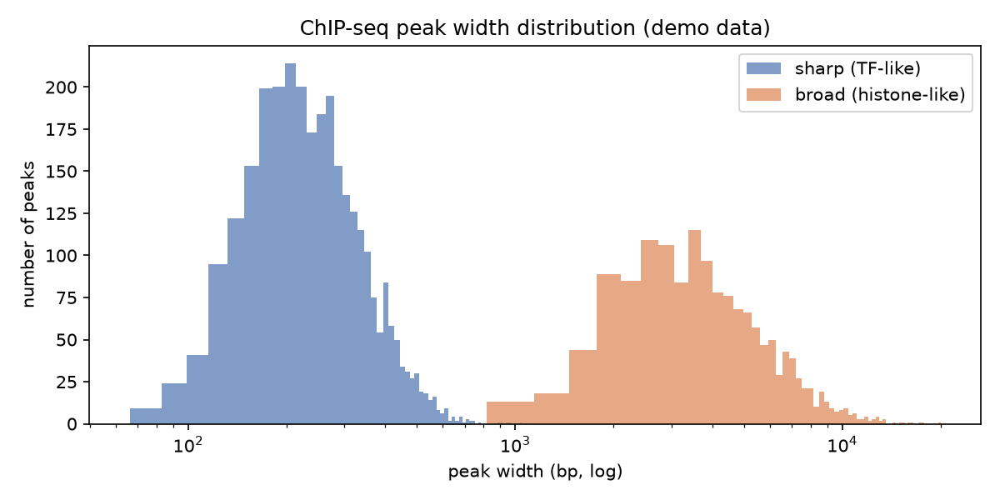

# Chipseq Peak Width Distribution

A ChIP-seq peak caller gives you thousands of intervals. Before you interpret a single one, their width distribution tells you what kind of mark you're even looking at.

## Why This Matters

Transcription factors bind narrow, well-defined sites; histone modifications like H3K27me3 spread over broad domains. If you call broad marks with sharp-peak settings (or vice versa) your results are garbage. The peak-width distribution reveals which regime your data is in and whether your caller settings match it.

## How It Works

1. Measure the width of every called peak.
2. Histogram the widths on a log scale.
3. Read off whether the marks are sharp, broad, or a mix.

## What the Demo Shows



The demo mixes sharp TF-like peaks around 250 bp with broad histone-like domains around 4 kb. The two humps make the bimodality obvious — the check that tells you to treat those two classes (and caller settings) differently.

## Run It

```bash
pip install -r requirements.txt
python demo.py
```

> Demonstrated on synthetic data, so it's fully reproducible with no external downloads.
